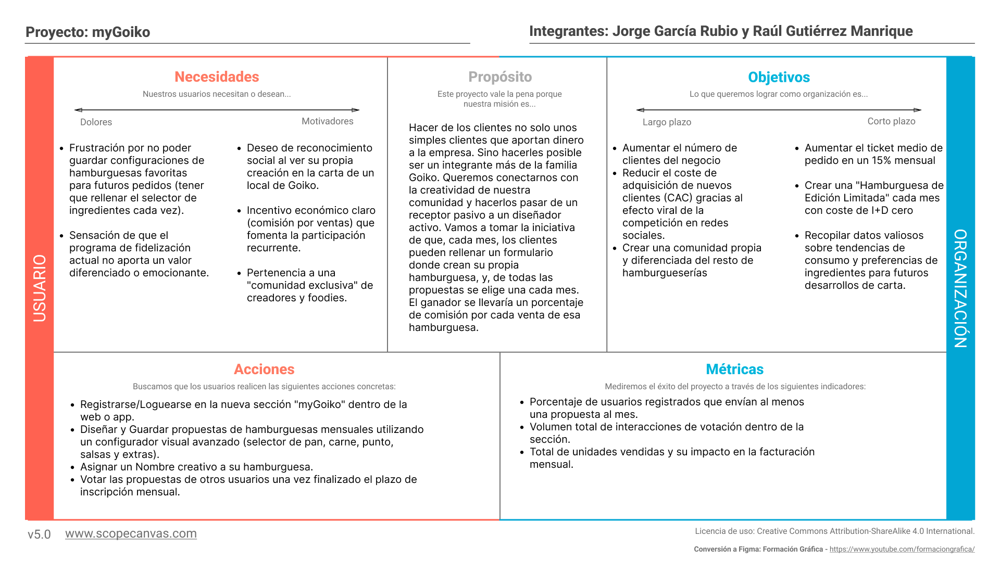
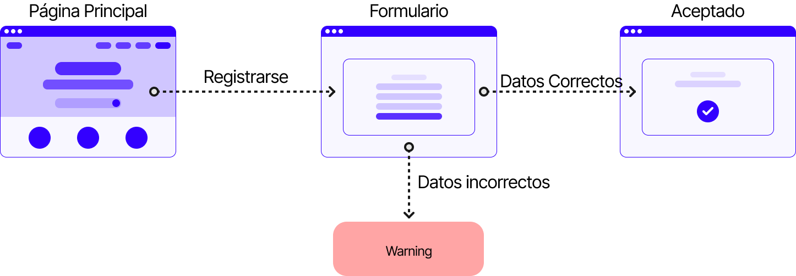

## DIU - Practica2, entregables

### Ideación 
* Mapa de empatía

### PROPUESTA DE VALOR
* ScopeCanvas

### TASK ANALYSIS

* **User Task Matrix. H: High. M: Medium. L: Low**

| Tareas / Grupos de Usuario | Jóvenes | Adultos | Trabajadores de Goiko |
| :--- | :---: | :---: | :---: |
| **Iniciar sesión / Registrarse** | H | M | H |
| **Pedir / Personalizar burger** | H | L | - |
| **Participar en concurso "myGoiko"** | H | M | L |
| **Reservar mesa en local** | H | H | - |
| **Consultar carta y alérgenos** | H | L | M |
| **Votar por la creación del mes** | H | L | L |
| **Validar propuestas ganadoras** | - | - | H |
| **Mirar perfiles de otros creadores** | M | L | L |

* **User/Task flow: se muestra el flujo de tres tareas que consideramos las más importantes:** registro, hacer un pedido y realizar tu creación de burger del mes

---

---

---

### ARQUITECTURA DE INFORMACIÓN

* Sitemap
 
* Labelling 

| Label                | Scope Note                                                   
|-------------------------|--------------------------------------------------------|
| Página de Inicio        | Página principal del sitio web                         |
| CONTACTO                | Sección para contactar con la organización             |
| Magazine                | Publicaciones y artículos sobre la temática            |
| QUIENES SOMOS           | Información sobre la organización y su misión          |
| Proyecto                | Descripción del proyecto principal                     |
| Impacto                 | Datos y métricas sobre el impacto del proyecto         |
| Transparencia           | Información sobre transparencia y gestión de recursos  |
| I+D                     | Investigación y desarrollo relacionados                |
| COLABORA                | Sección para colaborar con la organización             |
| Empresa                 | Cómo pueden colaborar las empresas                     |
| Institución Pública     | Participación de entidades gubernamentales             |
| Particular              | Opciones de colaboración para particulares             |
| Tiendas                 | Tiendas que participan en la iniciativa                |
| Contenedores            | Información sobre puntos de recogida                   |
| INICIO SESIÓN / REGISTRO | Sección de autenticación de usuarios                  |
| Perfil                  | Información y gestión del perfil de usuario            |
| Comunidad               | Espacio para interacción y colaboración entre usuarios |
| Foro/Chat               | Plataforma para discusión e intercambio de información |
| Crear Puntos de recogida | Opción para generar nuevos puntos de recogida         |
| Buscar Puntos de recogida | Opción para localizar puntos de recogida existentes  |
| Información Proceso     | Detalles sobre el proceso de recogida y participación  |
| Participar              | Formas en las que se puede participar                  |

### Prototipo Lo-FI Wireframe 

### Conclusiones  
(incluye valoración de esta etapa)

>>>> Este fichero se debe editar para que cada evidencia quede enlazada con el recurso subido a la carpeta de la practica. Se pide más detalle técnico en las descripciones de lo que sería el README principal del repositorio y que corresponde a la descripcion del Case Study.
>>>> Termine con la seccion de Conclusiones para aportar una valoración final del equipo sobre la propia realización de la práctica
