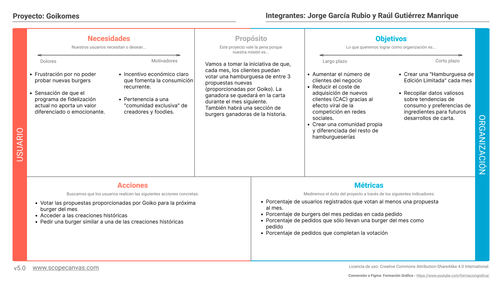
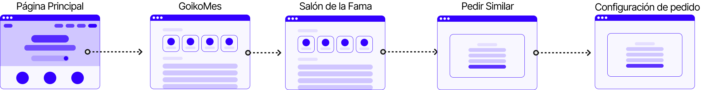
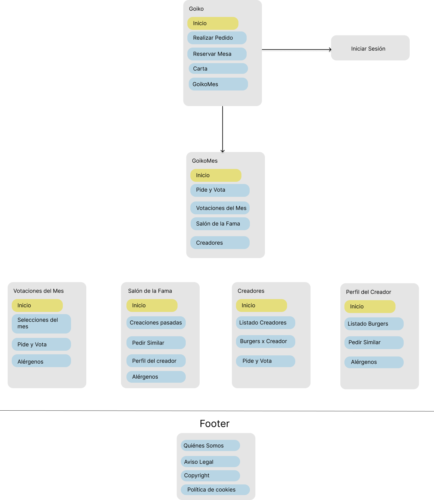
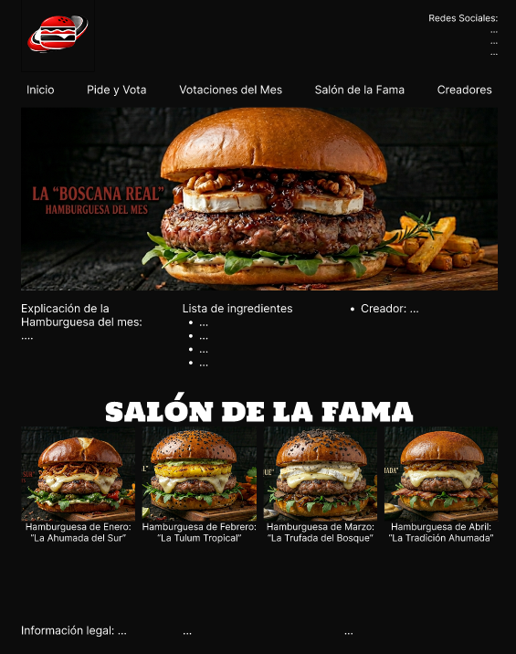
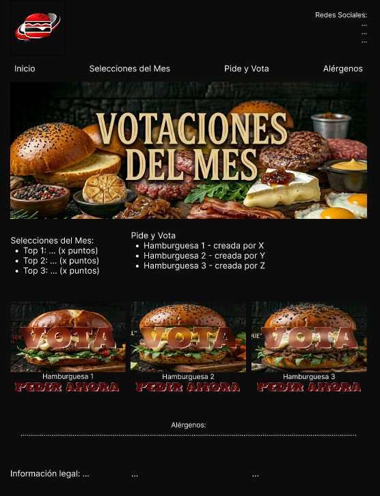
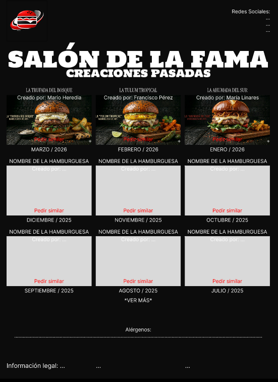
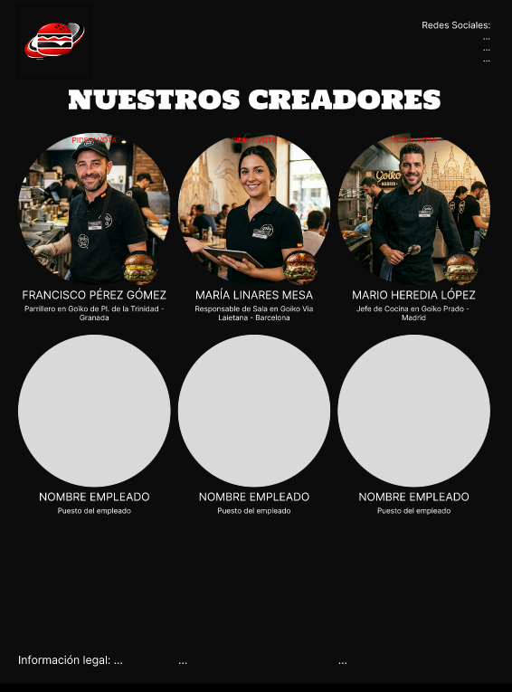
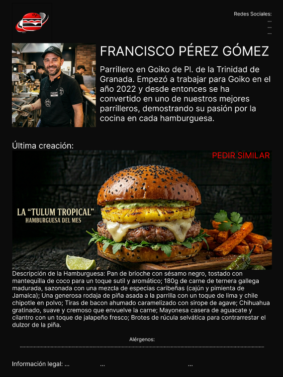
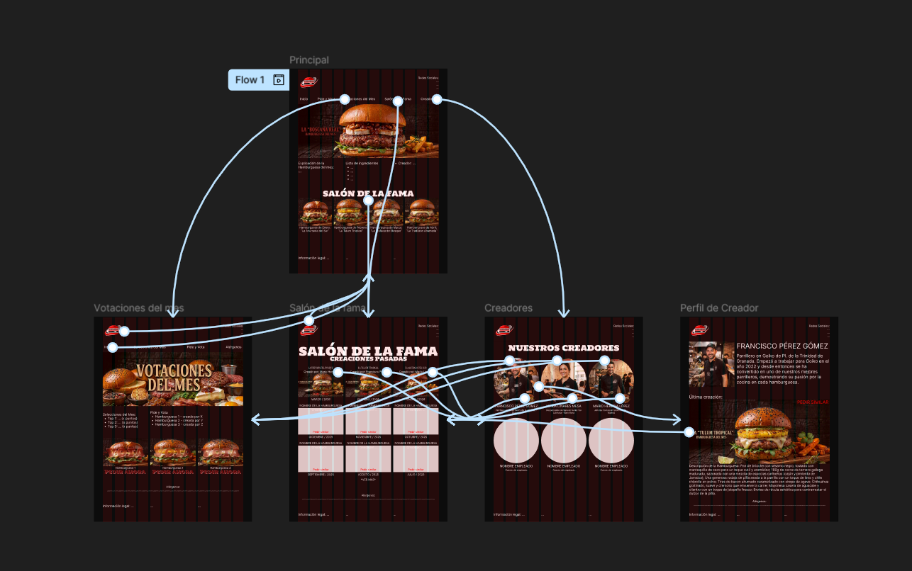

## DIU - Practica2, entregables

### Ideación 
* Mapa de empatía

### PROPUESTA DE VALOR
* ScopeCanvas

### TASK ANALYSIS

* **User Task Matrix. H: High. M: Medium. L: Low**

| Tareas / Grupos de Usuario | Jóvenes | Adultos | Trabajadores de Goiko |
| :--- | :---: | :---: | :---: |
| **Iniciar sesión / Registrarse** | H | M | H |
| **Personalizar burger** | M | L | - |
| **Participar en la votacion "GoikoMes** | H | M | L |
| **Reservar mesa en local** | H | H | - |
| **Consultar carta y alérgenos** | H | M | M |
| **Pedir a domicilio** | H | M | L |
| **Pedir la burger del mes** | M | H | M |
| **Mirar las GoikoMes históricas** | M | L | L |

* **User/Task flow: se muestra el flujo de tres tareas que consideramos las más importantes.** revisar las burgers pasadas (Salón de la Fama) y pedir una similar
    * Realizar pedido y votar:

    * Revisar las burgers pasadas (Salón de la Fama) y pedir una similar:  
  
    * Acceder al perfil de creaciones del creador de X burger  
  

### ARQUITECTURA DE INFORMACIÓN

* Sitemap
 
* Labelling 

| Label                   | Scope Note                                                   
|-------------------------|--------------------------------------------------------|
| Página de Inicio        | Página principal del sitio web                         |
| Iniciar Sesión          | Sección para iniciar sesión / Registrarse              |
| Realizar Pedido         | Página donde puedes realizar tu pedido                 |
| Vota la Burger del Mes  | Página sólo accesible después de pagar un pedido, vota la burger del mes |
| Reservar Mesa           | Página para reservar mesa en un local                  |
| Carta                   | Carta de la hamburguesería                             |
| Perfil Usuario          | Datos y pedidos del usuario                            |
| GoikoMes                | Página principal de la nueva propuesta                 |
| Pide y Vota             | Igual que Realizar Pedido                              |
| Votaciones del Mes      | Información sobre la votación de las actuales propuestas |
| Salón de la Fama        | Burgers y creadores pasados                            |
| Creadores               | Información sobre los creadores de las burgers del mes |
| Perfil del Creador      | Información sobre X creador de mínimo 1 burger del mes |
| Aviso Legal             | Página con términos y condiciones...                   |
| Copyright               | Sección sobre el copyright                             |
| Política de Cookies     | Cookis utilizadas en el sitio web                      |

### Prototipo Lo-FI Wireframe 
Para el diseño del prototipo se ha seguido un proceso Mobile-First adaptado a escritorio mediante un Grid Layout de 12 columnas (1440px). Se ha puesto especial énfasis en la jerarquía visual y la consistencia de los elementos (botones, tarjetas y navegación).
* **Distribución y Rejilla:** Se ha utilizado una rejilla de 12 columnas con un gutter de 20px, permitiendo que el contenido sea **responsive**. Las tarjetas de hamburguesas y creadores se han diseñado para ocupar 4 columnas, permitiendo un escalado fluido.
* **Componentes y Auto Layout:** Se han implementado componentes para las tarjetas de hamburguesas y para el header, utilizando **Auto Layout** de Figma para garantizar que el espaciado sea constante y que el diseño se adapte automáticamente al contenido de texto.
* **Interactividad:** El prototipo es funcional y permite navegar por el flujo completo de "GoikoMes".

**Recursos del Prototipo:**
* Página de Inicio:

* Votaciones del Mes:

* Salón de la Fama:

* Creadores:

* Perfil de Creador:

* Arquitectura de Conexiones:

* Enlace al prototivo interactivo en Figma:
https://www.figma.com/design/A6rDPMsQQNoGCJOEQcfLrb/Sin-t%C3%ADtulo?node-id=0-1&t=Pm9RMPRkGWGsdZhS-1

### Conclusiones  
(incluye valoración de esta etapa)

>>>> Este fichero se debe editar para que cada evidencia quede enlazada con el recurso subido a la carpeta de la practica. Se pide más detalle técnico en las descripciones de lo que sería el README principal del repositorio y que corresponde a la descripcion del Case Study.
>>>> Termine con la seccion de Conclusiones para aportar una valoración final del equipo sobre la propia realización de la práctica
