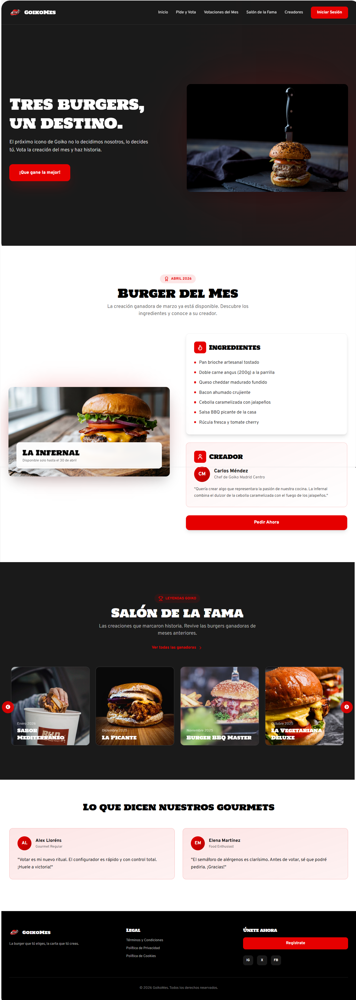

# DIU - Practica 3, entregables

- Moodboard (diseño visual + logotipo)
 
 
- Landing Page
   
  Nuestra landing page ofrece información sobre el proyecto, todo con un diseño claro y visual para que atraer a el publico que no se vayan rapido, sino que se interesen.
   
  
   
- Mockup: LAYOUT HI-FI
- Publicación del Case Study

## Conclusiones

>>>> Este fichero se debe editar para que cada evidencia quede enlazada con el recurso subido a la carpeta de la practica. Se pide más detalle técnico en las descripciones de lo que sería el README principal del repositorio y que corresponde a la descripcion del Case Study.
>>>> Termine con la seccion de Conclusiones para aportar una valoración final del equipo sobre la propia realización de la práctica
