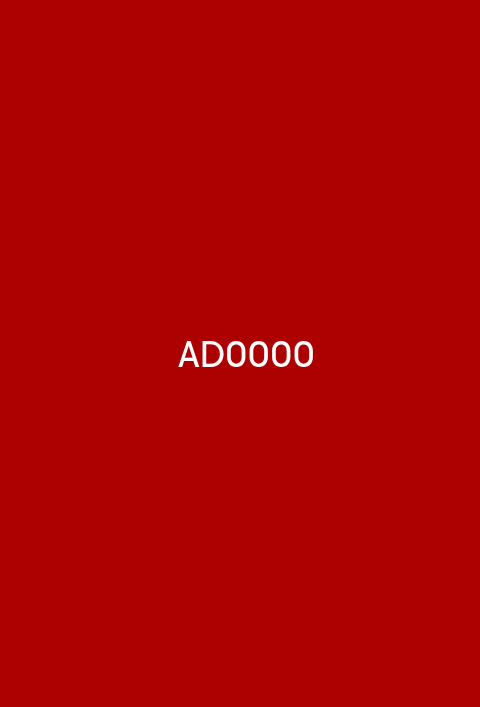
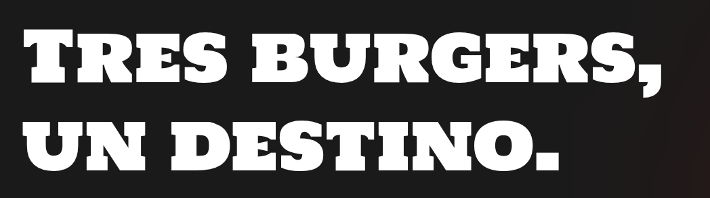
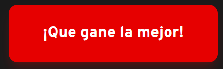
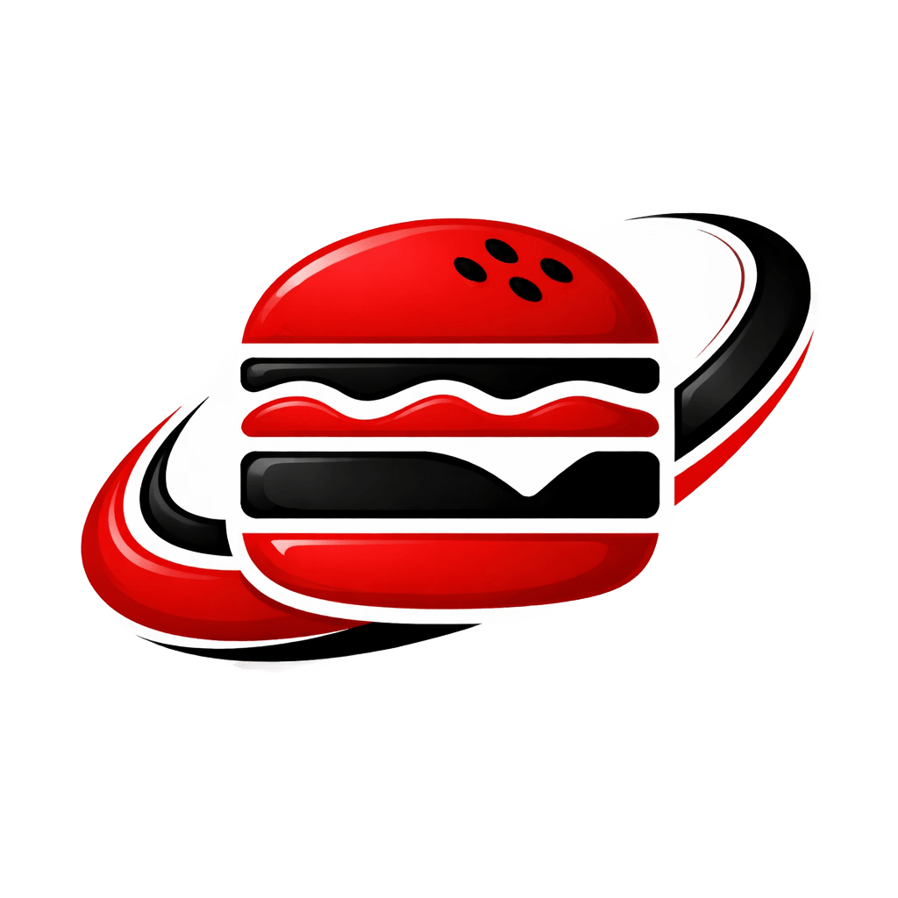
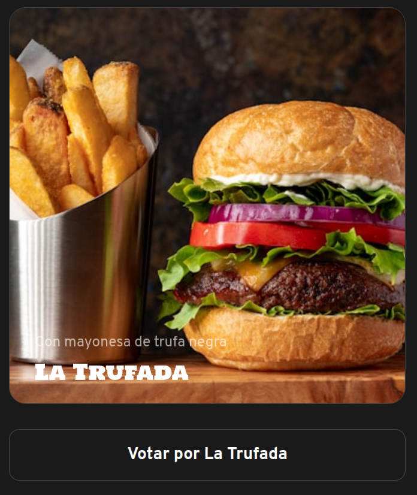
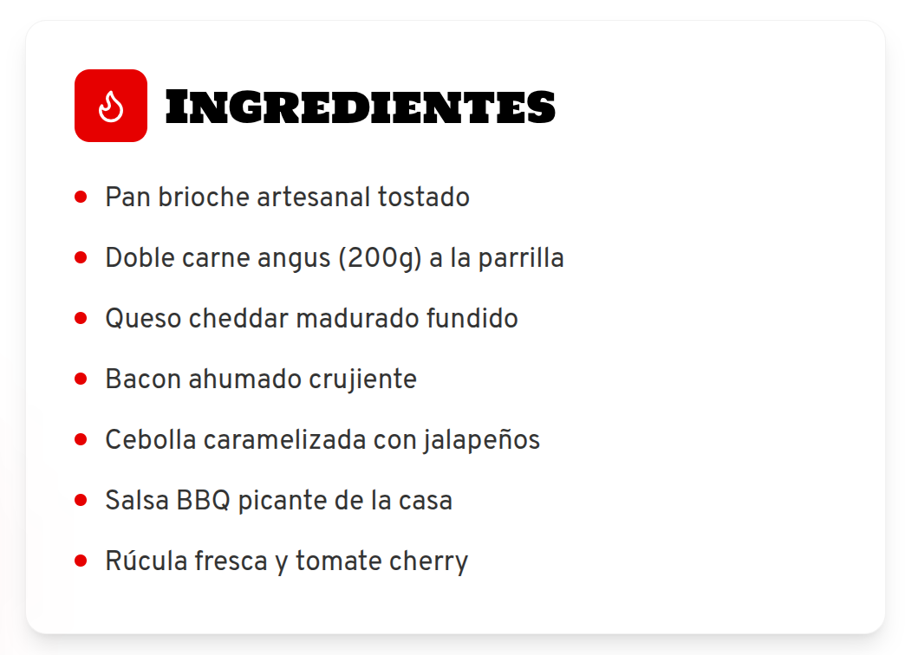
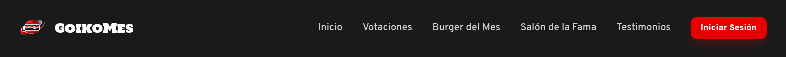
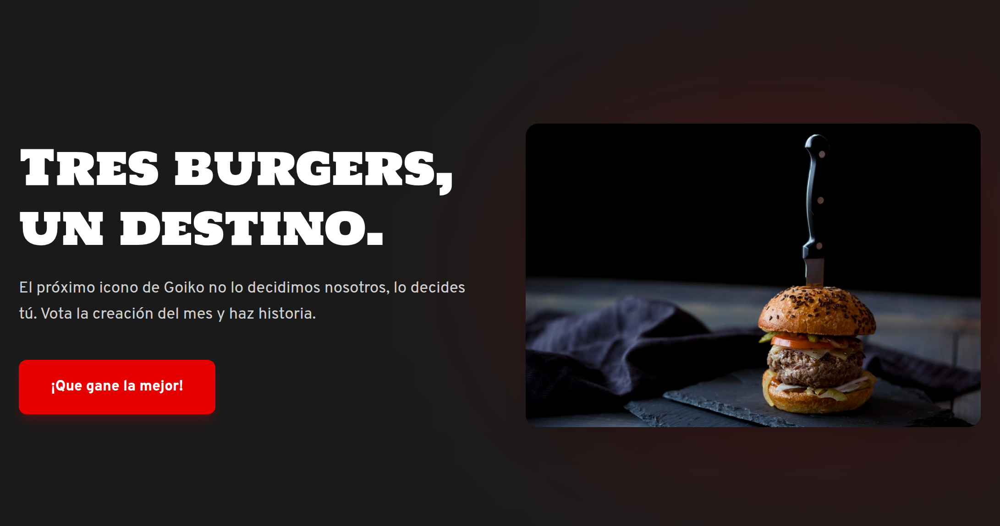

# DIU - Practica 3, entregables

- Moodboard (diseño visual + logotipo)

- Landing Page
Nuestra landing page ofrece información sobre el proyecto, todo con un diseño claro y visual para atraer al público y despertar su interés.

### - Elementos Atómicos

1. **Sistema de Color**: Definición de los colores base extraídos de la identidad visual.

2. **Tipografía**: Jerarquía visual. Por ejemplo, **Heading (H1)**: Estilo "Display", con peso ExtraBold y en mayúsculas para titulares como "TRES BURGERS, UN DESTINO".

3. **Botones**: Átomos de acción e interacción. El **botón primario** utiliza el color rojo corporativo, texto blanco en negrita y esquinas redondeadas (8px) para optimizar el área de clic.

4. **Iconografía**: Elementos gráficos mínimos. Por ejemplo, el **Logotipo** de GoikoMes que actúa como el identificador principal de la marca.

### - Moléculas
1. **Card de Producto**: combina la imagen del producto, el título de la burger, una breve descripción y el botón de acción.

2. **List Items**: ingredientes hace una unión de iconos de viñeta con texto de cuerpo para detallar los componentes de cada hamburguesa.

### - Organismos
1. **Header / Navbar**: es el organismo de control principal. Agrupa el logotipo, la molécula de enlaces de navegación (Tabs) y el átomo de botón "Iniciar Sesión"

2. **Hero Section**: el bloque de mayor impacto visual. Combina el titular H1, el subtítulo, el botón de acción principal y la imagen destacada del producto para captar la atención del usuario nada más aterrizar.

   

## Conclusiones

>>>> Este fichero se debe editar para que cada evidencia quede enlazada con el recurso subido a la carpeta de la practica. Se pide más detalle técnico en las descripciones de lo que sería el README principal del repositorio y que corresponde a la descripcion del Case Study.
>>>> Termine con la seccion de Conclusiones para aportar una valoración final del equipo sobre la propia realización de la práctica
