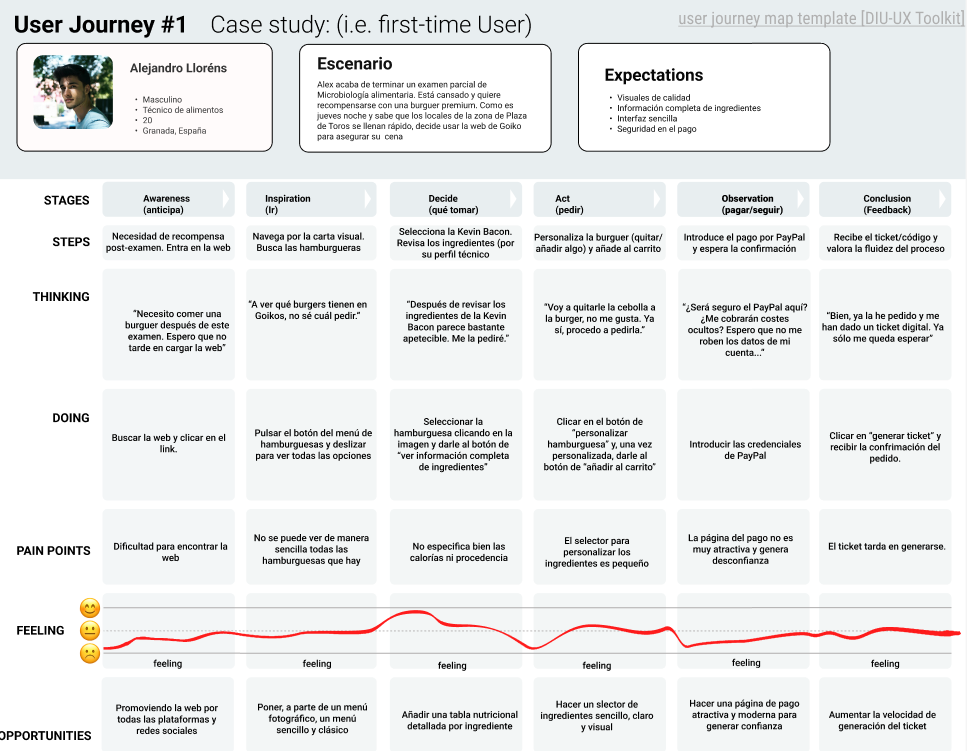
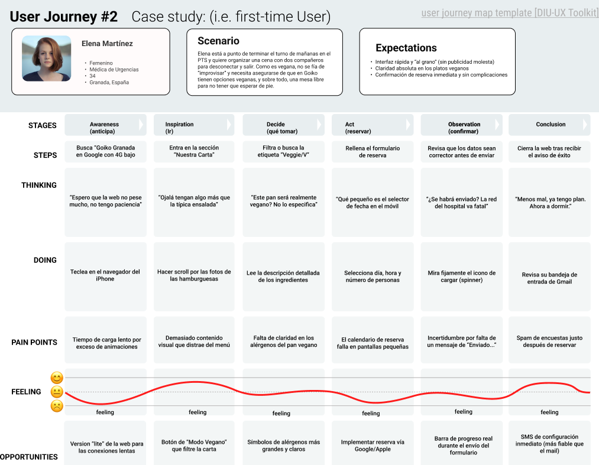

# DIU26
Prácticas Diseño Interfaces de Usuario (Tema: Fast Food Experience) 

* [Guiones de prácticas](GuionesPracticas/)

Actualizado: 26/02/2026

Grupo: DIU3.RESCUE

Curso: 2025/26 

Nombre del Proyecto: GoikoMes

Descripción: Es un proyecto donde vamos a tomar la iniciativa de que, cada mes, los clientes puedan votar una hamburguesa de entre 3 propuestas nuevas (proporcionadas por Goiko). La ganadora se quedará en la carta durante el mes siguiente. 

Logotipo: 

Miembros DIU3.RESCUE:
 * :bust_in_silhouette:  Jorge García Rubio     :octocat: https://github.com/jrgeegr     
 * :bust_in_silhouette:  Raúl Gutiérrez Manrique     :octocat: https://github.com/RaulGM03

----- 

 

# Proceso de Diseño 

 

## Paso 1. UX User & Desk Research & Analisis 

En la carpeta [P1](P1/) se encuentran mejor detallados los siguientes apartados.

### 1.a User Reseach Plan
 
-----

Nuestro plan de investigación se centra en evaluar la eficacia de la web de Goiko para usuarios con necesidades contrapuestas. Hemos seleccionado dos perfiles críticos: un usuario técnico/exigente (Alejandro) que busca precisión en los datos de los alimentos, y una usuaria con limitaciones de tiempo y dieta (Elena) que requiere rapidez y filtros claros (vegano). El objetivo es identificar fricciones en el proceso de pedido y reserva bajo condiciones de uso real.

### 1.b Competitive Analysis
 
-----

Hemos analizado la competencia directa de Goiko, comparándola con **Vicio** y **Five Guys**.
* **Vicio:** Destaca por una estética rompedora y un flujo de pedido extremadamente optimizado para móvil.
* **Five Guys:** Apuesta por el minimalismo y la personalización total, aunque su interfaz es algo austera.
* **Selección:** Se ha elegido Goiko para el estudio por ser el referente en España que intenta equilibrar una imagen de marca muy potente con un sistema complejo de reservas y fidelización (Goikoin).  

### 1.c Personas
 
-----

Hemos creado dos personas con objetivos opuestos para cubrir el mayor espectro de usuarios:
* **Alejandro Lloréns:** Técnico de alimentos, detallista y amante de la calidad. Representa al usuario que lee la "letra pequeña" y valora la transparencia.
* **Elena Martínez:** Médica de urgencias y vegana. Representa al usuario que navega con prisa, mala conexión y necesita encontrar opciones dietéticas específicas sin fricciones.

### 1.d User Journey Map
 
----

Se han diseñado dos mapas de experiencia (User Journey) que reflejan situaciones cotidianas:
1. **Alejandro:** Intenta personalizar un pedidio a domicilio tras un examen. Su experiencia decae ante la falta de información técnica clara en el checkout.
2. **Elena:** Intenta reservar mesa desde el hospital con mala cobertura. Su punto crítico es el peso de la web y la complejidad del formulario de reserva.
Estas experiencias son habituales y demuestran que la carga visual de la web a veces penaliza la funcionalidad.

### 1.e Usability Review
 
----

- **Enlace al documento:** [Usability Review](/P1/UsabilityReview.pdf)
- **URL y Valoración numérica obtenida:** www.goiko.com / 70 - Good
- **Comentario sobre la revisión:** La web destaca por un diseño visual impecable y una fotografía de producto excelente (puntos fuertes). Sin embargo, pierde puntos en eficiencia debido a tiempos de carga elevados en móvil y a un proceso de reserva que requiere demasiados clics y pasos de confrimación (puntos débiles).

 

## Paso 2. UX Design  

### 2.a Reframing / IDEACION: Feedback Capture Grid / EMpathy map 
 
----
  
    
Vamos a tomar la iniciativa de que, cada mes, los clientes puedan votar una hamburguesa de entre 3 propuestas nuevas (proporcionadas por Goiko). La ganadora se quedará en la carta durante el mes siguiente. 
También habrá una sección de burgers ganadoras de la historia.

### 2.b ScopeCanvas

----

### 2.b User Flow (task) analysis 
* **User Task Matrix. H: High. M: Medium. L: Low**

| Tareas / Grupos de Usuario | Jóvenes | Adultos | Trabajadores de Goiko |
| :--- | :---: | :---: | :---: |
| **Iniciar sesión / Registrarse** | H | M | H |
| **Personalizar burger** | M | L | - |
| **Participar en la votacion "GoikoMes** | H | M | L |
| **Reservar mesa en local** | H | H | - |
| **Consultar carta y alérgenos** | H | M | M |
| **Pedir a domicilio** | H | M | L |
| **Pedir la burger del mes** | M | H | M |
| **Mirar las GoikoMes históricas** | M | L | L |

* **User/Task flow: se muestra el flujo de tres tareas que consideramos las más importantes.** revisar las burgers pasadas (Salón de la Fama) y pedir una similar
    * Realizar pedido y votar:

    * Revisar las burgers pasadas (Salón de la Fama) y pedir una similar:  
  
    * Acceder al perfil de creaciones del creador de X burger  
  

### 2.c IA: Sitemap + Labelling 
* Sitemap
 
* Labelling 

| Label                   | Scope Note                                                   
|-------------------------|--------------------------------------------------------|
| Página de Inicio        | Página principal del sitio web                         |
| Iniciar Sesión          | Sección para iniciar sesión / Registrarse              |
| Realizar Pedido         | Página donde puedes realizar tu pedido                 |
| Vota la Burger del Mes  | Página sólo accesible después de pagar un pedido, vota la burger del mes |
| Reservar Mesa           | Página para reservar mesa en un local                  |
| Carta                   | Carta de la hamburguesería                             |
| Perfil Usuario          | Datos y pedidos del usuario                            |
| GoikoMes                | Página principal de la nueva propuesta                 |
| Pide y Vota             | Igual que Realizar Pedido                              |
| Votaciones del Mes      | Información sobre la votación de las actuales propuestas |
| Salón de la Fama        | Burgers y creadores pasados                            |
| Creadores               | Información sobre los creadores de las burgers del mes |
| Perfil del Creador      | Información sobre X creador de mínimo 1 burger del mes |
| Aviso Legal             | Página con términos y condiciones...                   |
| Copyright               | Sección sobre el copyright                             |
| Política de Cookies     | Cookis utilizadas en el sitio web                      |

### 2.d Wireframes
Para el diseño del prototipo se ha seguido un proceso Mobile-First adaptado a escritorio mediante un Grid Layout de 12 columnas (1440px). Se ha puesto especial énfasis en la jerarquía visual y la consistencia de los elementos (botones, tarjetas y navegación).
* **Distribución y Rejilla:** Se ha utilizado una rejilla de 12 columnas con un gutter de 20px, permitiendo que el contenido sea **responsive**. Las tarjetas de hamburguesas y creadores se han diseñado para ocupar 4 columnas, permitiendo un escalado fluido.
* **Componentes y Auto Layout:** Se han implementado componentes para las tarjetas de hamburguesas y para el header, utilizando **Auto Layout** de Figma para garantizar que el espaciado sea constante y que el diseño se adapte automáticamente al contenido de texto.
* **Interactividad:** El prototipo es funcional y permite navegar por el flujo completo de "GoikoMes".

**Recursos del Prototipo:**

* Página de Inicio:
  

* Votaciones del Mes:
  

* Salón de la Fama:
  

* Creadores:
  

* Perfil de Creador:
  

* Arquitectura de Conexiones:
  

* Enlace al prototivo interactivo en Figma:
https://www.figma.com/design/A6rDPMsQQNoGCJOEQcfLrb/Sin-t%C3%ADtulo?node-id=0-1&t=Pm9RMPRkGWGsdZhS-1

 

## Paso 3. Mi UX-Case Study (diseño)

>>> Cualquier título puede ser adaptado. Recuerda borrar estos comentarios del template en tu documento

### 3.a Moodboard

-----

>>> Diseño visual con una guía de estilos visual (moodboard) 
>>> Incluir Logotipo. Todos los recursos estarán subidos a la carpeta P3/
>>> Explique aqui la/s herramienta/s utilizada/s y el por qué de la resolución empleada. Reflexione ¿Se puede usar esta imagen como cabecera de Instagram, por ejemplo, o se necesitan otras?

### 3.b Landing Page
 
----

>>> Plantear el Landing Page del producto. Aplica estilos definidos en el moodboard

### 3.c Guidelines
 
----

>>> Estudio de Guidelines y explicación de los Patrones IU a usar 
>>> Es decir, tras documentarse, muestre las deciones tomadas sobre Patrones IU a usar para la fase siguiente de prototipado. 

### 3.d Mockup
 
----

>>> Consiste en tener un Layout en acción. Un Mockup es un prototipo HTML que permite simular tareas con estilo de IU seleccionado. Muy útil para compartir con stakeholders

 

## Paso 4. Pruebas de Evaluación 

### 4.a Reclutamiento de usuarios 

-----

>>> Breve descripción del caso asignado (llamado Caso-B) con enlace al repositorio Github
>>> Tabla y asignación de personas ficticias (o reales) a las pruebas. Exprese las ideas de posibles situaciones conflictivas de esa persona en las propuestas evaluadas. Mínimo 4 usuarios: asigne 2 al Caso A y 2 al caso B.

| Usuarios | Sexo/Edad     | Ocupación   |  Exp.TIC    | Personalidad | Plataforma | Caso
| ------------- | -------- | ----------- | ----------- | -----------  | ---------- | ----
| User1's name  | H / 18   | Estudiante  | Media       | Introvertido | Web.       | A 
| User2's name  | H / 18   | Estudiante  | Media       | Timido       | Web        | A 
| User3's name  | M / 35   | Abogado     | Baja        | Emocional    | móvil      | B 
| User4's name  | H / 18   | Estudiante  | Media       | Racional     | Web        | B 

### 4.b Diseño de las pruebas 
 
-----

>>> Planifique qué pruebas se van a desarrollar. ¿En qué consisten? ¿Se hará uso del checklist de la P1?

### 4.c Cuestionario SUS
 
----

>>> Como uno de los test para la prueba A/B testing, usaremos el **Cuestionario SUS** que permite valorar la satisfacción de cada usuario con el diseño utilizado (casos A o B). Para calcular la valoración numérica y la etiqueta linguistica resultante usamos la [hoja de cálculo](https://github.com/mgea/DIU19/blob/master/Cuestionario%20SUS%20DIU.xlsx). Previamente conozca en qué consiste la escala SUS y cómo se interpretan sus resultados
http://usabilitygeek.com/how-to-use-the-system-usability-scale-sus-to-evaluate-the-usability-of-your-website/)
Para más información, consultar aquí sobre la [metodología SUS](https://cui.unige.ch/isi/icle-wiki/_media/ipm:test-suschapt.pdf)
>>> Adjuntar en la carpeta P4/ el excel resultante y describa aquí la valoración personal de los resultados 

### 4.d A/B Testing
 
-----

>>> Los resultados de un A/B testing con 3 pruebas y 2 casos o alternativas daría como resultado una tabla de 3 filas y 2 columnas, además de un resultado agregado global. Especifique con claridad el resultado: qué caso es más usable, A o B?

### 4.e Aplicación del método Eye Tracking 

----

>>> Indica cómo se diseña el experimento y se reclutan los usuarios. Explica la herramienta / uso de gazerecorder.com u otra similar. Aplíquese únicamente al caso B.

  
>>> Cambiar esta img por una de vuestro experimento. El recurso deberá estar subido a la carpeta P4/  

>>> gazerecorder en versión de pruebas puede estar limitada a 3 usuarios para generar mapa de calor (crédito > 0 para que funcione) 

### 4.f Usability Report de B
 
-----

>>> Añadir report de usabilidad para práctica B (la de los compañeros) aportando resultados y valoración de cada debilidad de usabilidad. 
>>> Enlazar aqui con el archivo subido a P4/ que indica qué equipo evalua a qué otro equipo.

>>> Complementad el Case Study en su Paso 4 con una Valoración personal del equipo sobre esta tarea

 

## Paso 5. Exportación y Documentación 

### 5.a Exportación a HTML/React
 
----

>>> Breve descripción de esta tarea. Las evidencias de este paso quedan subidas a P5/

### 5.b Documentación con Storybook

----

>>> Breve descripción de esta tarea. Las evidencias de este paso quedan subidas a P5/

 

## Conclusiones finales & Valoración de las prácticas

>>> Opinión FINAL del proceso de desarrollo de diseño siguiendo metodología UX y valoración (positiva /negativa) de los resultados obtenidos. ¿Qué se puede mejorar? Recuerda que este tipo de texto se debe eliminar del template que se os proporciona 

